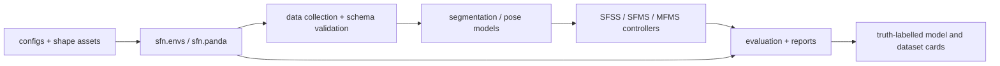

# Peg-in-Hole SFN Software Pipeline

Supported simulation, perception, controller, and Franka Panda validation software for the SFN peg-in-hole research project. The package targets Python 3.11–3.12 and intentionally distinguishes fast software checks from evidence-bearing experiments.

## Backend truth labels

Every dataset card, model card, benchmark table, and research claim should carry exactly one of these labels:

| Label | What it actually represents | Valid use | Not evidence of |
|---|---|---|---|
| `toy_direct` | Fast rectangle-based legacy renderer and kinematic alignment | Unit tests, debugging, smoke checks | Unseen-mesh generalization, physical contact, robot execution |
| `mesh_orthographic` | Deterministic RGB/mask rendering from peg and hole-opening meshes | Asset-faithful visual experiments | Robot camera behavior, dynamics, real hardware |
| `panda_native_camera` | PyBullet Panda scene using native RGB/body-ID rendering | Robot-scene simulation and execution-bridge validation | Real sensors, real contact, hardware safety |
| `real_hardware` | Measurements collected on a physical robot with documented calibration | Hardware results within the recorded operating envelope | Conditions, shapes, or sensors not tested |

Historical sub-millimetre Cartesian results used `toy_direct`. They are useful proof-of-concept results, but must not be relabelled as mesh, contact-insertion, or hardware evidence.

## Architecture



- `sfn/envs`: alignment, insertion, asset registry, scene, and rendering contracts.
- `sfn/data`: deterministic collection, schemas, split policy, augmentation, and validation.
- `sfn/models` and `sfn/training`: perception and controller implementations/training loops.
- `sfn/evaluation`: metrics, disturbances, statistical summaries, visuals, and artifacts.
- `sfn/panda`: Panda model, command/measurement boundary, camera, attachment, and validation.
- `scripts`: thin command-line entry points; `tests`: software and experiment-contract checks.

## Install and verify

From this directory:

```powershell
python -m pip install -e ".[dev]"
python scripts/smoke_software.py
```

The default smoke runs focused release lint/type/CLI checks. Before merging or releasing, the full mode runs Ruff over supported source, the typed smoke runner, and the complete CPU test suite:

```powershell
python scripts/smoke_software.py --full
```

GitHub Actions runs that full command on Python 3.11 and 3.12 with CUDA hidden and Matplotlib in headless mode.

## Supported workflows

### 1. Validate assets and collect data

```powershell
python scripts/validate_assets.py --strict-dependencies
python scripts/collect_dataset.py --split train_seen --samples-per-shape 32 --out data/train_seen
python scripts/validate_dataset.py --dataset data/train_seen
```

Use `python <script> --help` as the source of truth for current flags. Preserve split manifests, seeds, config, Git SHA, checksums, and a completed [dataset card](docs/DATASET_CARD_TEMPLATE.md).

### 2. Train perception/controllers

The `train_segmentation.py`, `train_position.py`, `train_orientation.py`, `train_sfms.py`, and `train_mfms.py` entry points own their respective workflows. Training output is not a release result until its immutable checkpoint, dataset version, seed, selection rule, and backend label are recorded in a [model card](docs/MODEL_CARD_TEMPLATE.md).

### 3. Evaluate and report

Use `evaluate.py`, `evaluate_perception.py`, or `evaluate_robustness.py`. Keep seen and unseen shape splits separate; report sample counts and uncertainty; distinguish oracle/ground-truth inputs from model predictions. Never compare rows with different backend labels as though they measured the same claim.

A small complete benchmark can be reproduced with:

```powershell
python scripts/run_final_benchmark.py --quick --out artifacts/final_benchmark_quick
```

Remove `--quick` for the evidence-sized mesh and Panda matrix. Every supported evaluation now writes `resolved_config.json`, `run_manifest.json`, episode records, step records and statistical summaries. `evaluate.py --backend panda_kinematic` and `--backend panda_dynamic` expose Panda execution through the same top-level evaluation entry point.

### 4. Panda simulation bridge

The `panda_validate_*`, `panda_evaluate_*`, and `collect_panda_native_dataset.py` commands cover model, IK, command tracking, attachment, camera observability, controller, and insertion checks. These are `panda_native_camera` simulation results unless data came from documented physical hardware.

### 5. Miniature end-to-end and long training

The miniature workflow proves that a fresh software path can perform collection, perception training, SFMS/MFMS warm starts, Cartesian evaluation, Panda evaluation and report generation:

```powershell
python scripts/run_miniature_e2e.py --out artifacts/miniature_e2e
```

The staged SFMS curriculum progresses from small XY errors through yaw, full range, predicted masks, randomized perception and burst occlusion. A full three-seed run is intentionally a long experiment:

```powershell
python scripts/run_multiseed_curriculum.py --seeds 101,102,103 --segmentation models/segmentation_mesh_v2_ce.pt --position models/position_mesh_v2_geometric.pt --orientation models/orientation_mesh_v2_symmetry_hybrid.pt --initial-policy models/sfms_mesh_v2_teacher_compatible.pt --out artifacts/sfms_multiseed
```

### 6. Future real-frame preparation

`sfn.sim2real` and the corresponding scripts provide strict camera-calibration files, image/video replay through the VSN, multiclass COCO/CVAT/Label Studio annotation exchange, pseudo-label review queues, active-learning selection, small-real-dataset segmentation fine-tuning and a robot-agnostic safety-gated command interface. These tools prepare the data path; they do not constitute hardware validation.

## Release checklist

1. Run `python scripts/smoke_software.py --full` on a clean checkout.
2. Archive exact commands, dependency environment, Git SHA, seeds, configs, and artifact checksums.
3. Validate datasets and confirm shape/episode split integrity.
4. Complete model and dataset cards; attach backend truth labels to all reported numbers.
5. Review known failures and safety boundaries before any hardware execution.

The dependency-ordered completion plan, when present in the working tree, is maintained under `artifacts/software_completion_20260713/MASTER_SOFTWARE_COMPLETION_PLAN.md`.
